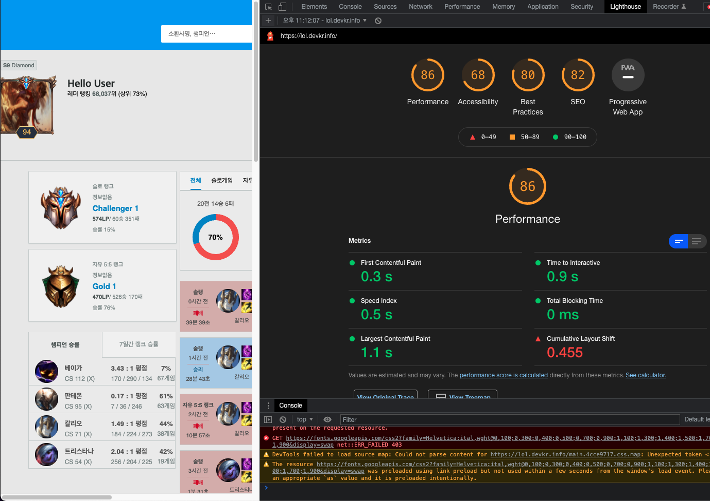
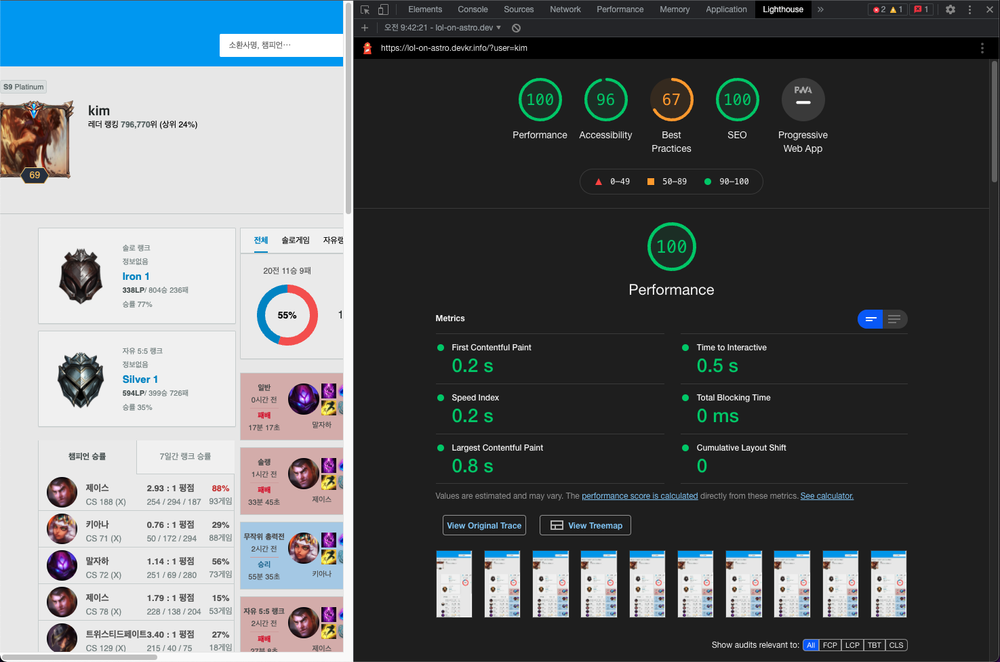

# 📌 롤 전적검색 astro버전 📌

## 설명
- create-react-app기반의 앱을 astro버전으로 리팩토링한 롤 전적검색 앱입니다
- Astro는 partial hydration 기능을 지원하는 SSG 프레임워크 입니다

## 실행방법 
본 리포지토리를 git clone으로 다운받은 후 `npm i && npm run dev`를 입력합니다\
\
또는 `pnpm i && pnpm dev`를 입력합니다\
\
node.js 버전 17.4.0이 필요합니다

## 웹에서 실행하기
- 클라우드플레어 버전은 `https://lol-on-astro.devkr.info` 에서 이용이 가능합니다
- `https://lol-on-astro.devkr.info/?user={username}` 형태로 유저네임을 직접 검색할 수 있습니다
- fastly 버전은 `http://lol-on-fastly.devkr.info/` 에서 이용이 가능합니다
- `https://lol-on-fastly.devkr.info/?user={username}` 형태로 유저네임을 직접 검색할 수 있습니다

## 퍼포먼스 비교 (i7-2600 @ 크롬 97.0.4692.99에서 수행되었습니다)

<table>
    <tr>
        <td>지표</td>
        <td>이전 (create-react-app @ netlify)</td>
        <td>이후 (astro @ cloudflare pages)</td>
        <td>이후 (astro @ fastly)</td>
    </tr>
    <tr>
        <td>TTFB</td>
        <td>84.4 ~ 487.4 ms</td>
        <td>13.9 ~ 22.5ms</td>
        <td>3.2 ~ 3.5 ms</td>
    </tr>
    <tr>
        <td>DOMContentLoaded 이벤트 트리거</td>
        <td>1004 ~ 2120 ms</td>
        <td>304 ~ 354 ms</td>
        <td>227ms ~ 271 ms</td>
    </tr>    
    <tr>
        <td>Load 이벤트 트리거</td>
        <td>1710 ~ 2910 ms</td>
        <td>357 ~ 414 ms</td>
        <td>271 ~ 317 ms</td>
    </tr>        
</table>

## 라이트하우스 스코어  (m1 맥미니에서 수행되었습니다)

전) create-react-app @ netlify 버전

후) astro @ cloudflare pages 버전

astro로 변경한 이후 Largest Contentful Paint의 소모시간이 약 300ms 단축되었습니다.\
TTI는 약 400ms 단축되었습니다\
Cumulative Layout Shift는 직접 최적화 하였습니다

## 스택

- Astro
- react
- SASS Module
- Cloudflare Pages
 

 

## further study
- remix 버전으로 리팩토링하여 퍼포먼스를 비교합니다