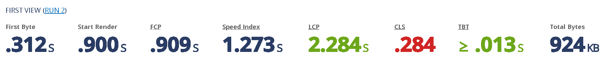
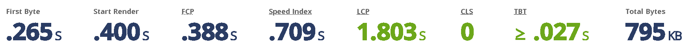

# 📌 롤 전적검색 astro버전 📌

## 설명
- create-react-app기반의 앱을 astro버전으로 리팩토링한 롤 전적검색 앱입니다
- Astro는 partial hydration 기능을 지원하는 SSG 프레임워크 입니다

## 실행방법 
본 리포지토리를 git clone으로 다운받은 후 `npm i && npm run dev`를 입력합니다\
\
또는 `pnpm i && pnpm dev`를 입력합니다\
\
node.js 버전 17.4.0이 필요합니다

## 웹에서 실행하기
- 클라우드플레어 버전은 `https://lol-on-astro.devkr.info` 에서 이용이 가능합니다
- `https://lol-on-astro.devkr.info/?user={username}` 형태로 유저네임을 직접 검색할 수 있습니다
- fastly 버전은 `http://lol-on-fastly.devkr.info/` 에서 이용이 가능합니다
- `https://lol-on-fastly.devkr.info/?user={username}` 형태로 유저네임을 직접 검색할 수 있습니다


## 퍼포먼스 비교 (CDN 캐쉬히트 기준. i7-2600 @ 크롬 97.0.4692.99에서 수행되었습니다)

<table>
    <tr>
        <td>지표</td>
        <td>이전 (create-react-app @ netlify)</td>
        <td>이후 (astro @ cloudflare pages)</td>
        <td>이후 (astro @ fastly)</td>
    </tr>
    <tr>
        <td>TTFB</td>
        <td>84.4 ~ 487.4 ms</td>
        <td>13.9 ~ 22.5ms</td>
        <td><b style="color:red"> 3.2 ~ 3.5 ms</b></td>
    </tr>
    <tr>
        <td><del>DOMContentLoaded 이벤트 트리거</del></td>
        <td><del>1004 ~ 2120 ms</del></td>
        <td><del>304 ~ 354 ms</del></td>
        <td><del>227ms ~ 271 ms</del></td>
    </tr>    
    <tr>
        <td><del>Load 이벤트 트리거</del></td>
        <td><del>1710 ~ 2910 ms</del></td>
        <td><del>357 ~ 414 ms</del></td>
        <td><del>271 ~ 317 ms</del></td>
    </tr>        
</table>

## 퍼포먼스 비교 (webpagetest.org 제공)
미국 버지니아 주에서 데스크톱 크롬으로 실시한 벤치마크입니다

이전 (create-react-app @ netlify)

상세는 [여기서](https://www.webpagetest.org/result/220203_BiDcJS_ff9882f16abeeaa1bbf559c3643e3e73/) 확인할 수 있습니다

이후 (astro @ fastly)

상세는 [여기서](https://www.webpagetest.org/result/220203_BiDcKZ_a8ace8a73f75b9d23c0ae63cf51c2285/) 확인할 수 있습니다


## 라이트하우스 스코어  (m1 맥미니에서 수행되었습니다)

전) create-react-app @ netlify 버전


후) astro @ cloudflare pages 버전


astro로 변경한 이후 Largest Contentful Paint의 소모시간이 약 300ms 단축되었습니다.\
TTI는 약 400ms 단축되었습니다\
Cumulative Layout Shift는 직접 최적화 하였습니다

<del>
## 클라우드플레어 버전에 http3로 접속하기

클라우드플레어는 http3를 지원합니다. 커넥션이 http3기반으로 이루어지는지 확인하기 위해서 아래의 절차를 진행합니다\
먼저 `https://lol-on-astro.devkr.info/cdn-cgi/trace`에 접속합니다. 그러면 아래와 같은 텍스트가 표시됩니다
```
fl=34f140
h=lol-on-astro.devkr.info
ip=121.172.71.142
ts=1643853395.88
visit_scheme=https
uag=Mozilla/5.0 (Windows NT 10.0; Win64; x64) AppleWebKit/537.36 (KHTML, like Gecko) Chrome/98.0.4758.81 Safari/537.36
colo=ICN
http=http/2
loc=KR
tls=TLSv1.3
sni=plaintext
warp=off
gateway=off
```
위의 텍스트에서 `http=`라는 항목에 `http/2`라고 표기되어 있습니다. 이는 웹브라우저가 http3를 지원하지 않기 때문입니다. http3기능 활성화를 원한다면 아래의 절차를 진행합니다
1. 크로미움 계열의 브라우저에서 `chrome://flags`를 입력합니다
1. `Search flags` 검색창에서 `Experimental QUIC protocol`을 입력합니다
1. `Experimental QUIC protocol` 항목을 `Enabled`로 변경하고 웹브라우저를 재시작합니다
</del>

## 스택

- Astro
- react
- SASS Module
- Cloudflare Pages & fastly
 


<br/>


## further study
- remix 버전으로 리팩토링하여 퍼포먼스를 비교합니다